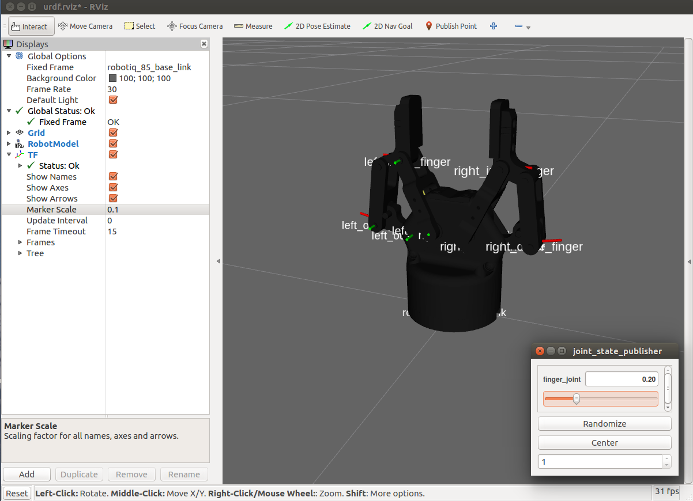

robotiq_arg85_description
=========================

ROS package providing a URDF model of the Robotiq 2-Finger Adaptive Robot Gripper 85.

View the gripper in `RViz` by running

    roslaunch robotiq_arg85_description display.launch gui:=true

